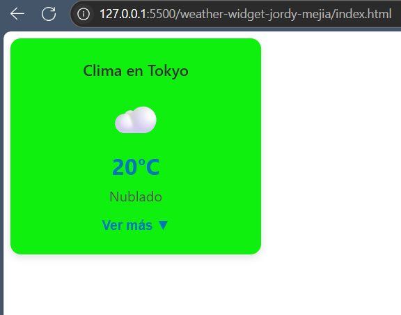
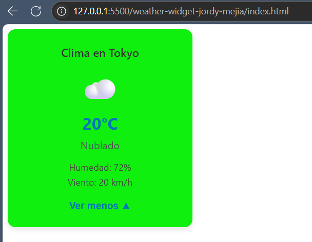
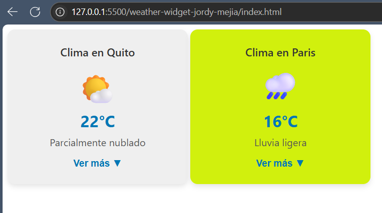

# Weather Widget 🌤️

Este componente web personalizado `<weather-widget>` muestra el clima actual de una ciudad, incluyendo ícono del clima, temperatura, estado general, y permite mostrar/ocultar información adicional como humedad y velocidad del viento. Está construido usando Web Components con Shadow DOM, estilos encapsulados y atributos personalizados.

---

## 🧩 Explicación del componente

`<weather-widget>` es un componente reutilizable que permite visualizar el clima de distintas ciudades simuladas (mock). Incluye:

- Ícono representativo del clima.
- Temperatura actual.
- Descripción del estado del clima.
- Información adicional (humedad y viento).
- Botón interactivo para mostrar u ocultar la información adicional.
- Estilos encapsulados usando `Shadow DOM`.
- Uso de `slot` para agregar un título personalizado.
- Personalización de color de fondo mediante atributo.

---

## ⚙️ Atributos personalizados

| Atributo     | Descripción                                                   | Ejemplo                |
|--------------|---------------------------------------------------------------|------------------------|
| `city`       | Nombre de la ciudad para mostrar el clima.                   | `city="Quito"`         |
| `bg-color`   | Color de fondo del componente (usa cualquier color CSS válido) | `bg-color="#f0f0f0"`   |

---

## 📸 Capturas de pantalla del componente en uso

> 💡 Agrega aquí tus capturas de pantalla. Puedes usar esta estructura:

### Estado inicial



### Información adicional desplegada



### Clima con distintos colores



---

## 💻 Código de ejemplo para reutilizar el componente

### 1. Incluir el archivo del componente

```html
<script type="module" src="weather-widget.js"></script> 